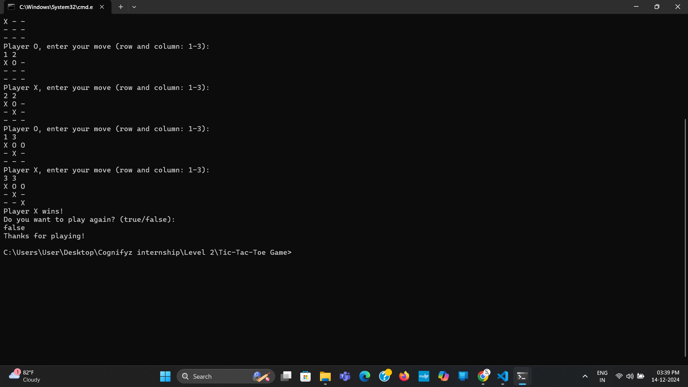

# ❌⭕ Tic Tac Toe Game

## 📌 Project Overview

The **Tic Tac Toe Game** is a simple Java-based console application that allows two players to play the classic Tic Tac Toe game. It demonstrates core Java programming concepts such as arrays, loops, conditional statements, user input handling, and game logic.

This project is ideal for beginners to understand problem-solving and game development fundamentals in Java.

---

## 🎯 Objectives

- Develop a console-based Tic Tac Toe game.
- Practice Java programming fundamentals.
- Implement game logic using loops and conditions.
- Enhance logical thinking and problem-solving skills.

---

## 🛠️ Technologies Used

- Java
- JDK (Java Development Kit)

---

## 📁 Project Structure

```text
TicTacToe-Game/
│── TicTacToe.java
│── TicTacToe.class
│── Output.png
│── tic.mp4
└── README.md
```

---

## ✨ Features

- ❌ Two-Player Gameplay
- ⭕ Interactive Console Interface
- 🎮 Turn-by-Turn Play
- 🏆 Win Detection
- 🤝 Draw Detection
- 💻 Beginner-Friendly Implementation

---

## 🚀 Getting Started

### Prerequisites

- Java JDK 8 or above

### Installation

1. Clone or download this repository.
2. Navigate to the project folder.
3. Compile the Java source file:

```bash
javac TicTacToe.java
```

4. Run the program:

```bash
java TicTacToe
```

---

## 📖 How to Play

1. Run the application.
2. Player X enters their move.
3. Player O enters their move.
4. The game continues until:
   - A player wins, or
   - The match ends in a draw.
5. The final result is displayed on the console.

---

## 📷 Sample Output



---

## 🎥 Demo Video

[▶️ Watch Demo](tic.mp4)

---

## 💡 Learning Outcomes

- Java Programming Fundamentals
- Arrays and Loops
- Conditional Statements
- User Input Handling
- Game Logic Development
- Problem Solving

---

## 🔮 Future Enhancements

- 🤖 Single Player Mode with AI
- 🎨 Graphical User Interface (GUI)
- 🔄 Restart Game Option
- 📊 Score Tracking
- 🌐 Online Multiplayer Support

---

## 👩‍💻 Author

**AtheefaA**

GitHub: https://github.com/AtheefaA

---

## 📄 License

This project is intended for educational and portfolio purposes.
